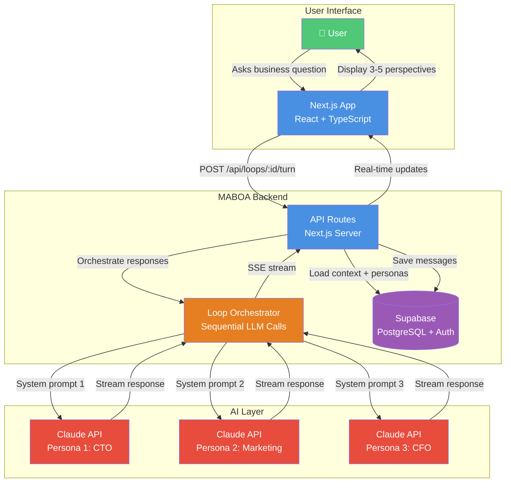

# Simplified Multi-Advisor Loop Architecture

## For Medium Article

This is a simplified version of the multi-advisor orchestration flow, optimized for Medium readers.



## Rendering Instructions for Medium

1. Go to https://mermaid.live
2. Paste the mermaid code above
3. Adjust theme to "neutral" or "default"
4. Export as PNG (high resolution)
5. Upload to Medium
6. Add caption: "Multi-Advisor Loop Architecture: Sequential LLM calls orchestrated through a central service, streaming responses via SSE"

## Simplified Text Description (if diagram doesn't render)

**How Multi-Advisor Loops Work:**

1. **User asks a question** → Next.js frontend
2. **API loads context** → Persona profiles + conversation history from Supabase
3. **Loop Orchestrator** → Makes sequential calls to Claude API (one per persona)
4. **Each persona gets unique system prompt** → CTO, Marketing, CFO perspectives
5. **Responses stream back** → Server-Sent Events (SSE) for real-time updates
6. **UI displays 3-5 perspectives** → User sees diverse viewpoints simultaneously
7. **All messages saved** → Persistent loop history in PostgreSQL

**Key Constraint:** Sequential (not parallel) to manage costs and avoid race conditions

---

## Alternative: Even Simpler Flow (5 Boxes)

```
┌─────────────┐
│    User     │
│  Question   │
└──────┬──────┘
       │
       ▼
┌─────────────┐
│   Backend   │
│  Selects    │
│ 3-5 Personas│
└──────┬──────┘
       │
       ▼
┌─────────────┐
│ Claude API  │
│ Sequential  │
│   Calls     │
└──────┬──────┘
       │
       ▼
┌─────────────┐
│ SSE Stream  │
│   Back to   │
│     UI      │
└──────┬──────┘
       │
       ▼
┌─────────────┐
│   Display   │
│   Multiple  │
│ Perspectives│
└─────────────┘
```

This ASCII version could work directly in Medium if image doesn't load.
